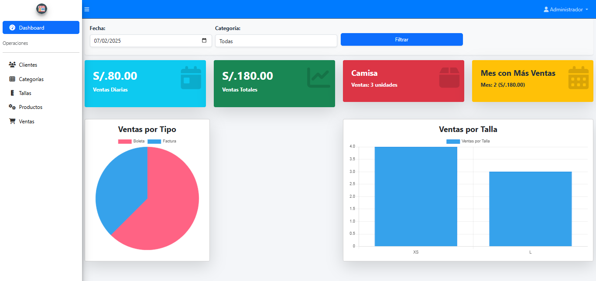

# Sistema Punto de Venta

Este es un sistema web de punto de venta desarrollado con Laravel, diseñado para facilitar el control de las ventas y automatizar la gestión del inventario. Con este sistema, se puede llevar un registro eficiente de las transacciones comerciales y controlar el stock de productos en tiempo real.



## Requisitos
- PHP 8.2 o superior
- Composer 
- MySQL
- XAMPP

# Proyecto de Ventas en Laravel

Este es un sistema de ventas desarrollado con Laravel, enfocado en la gestión de productos, clientes, categorías, tallas y ventas. El sistema permite a los usuarios realizar acciones como la creación de ventas, administración de productos, clientes y categorías.

## Requisitos

Este proyecto requiere:

- PHP 8.1 o superior
- Base de datos compatible (como MySQL)

## Instalación

Para instalar y configurar el proyecto en tu entorno local, sigue estos pasos detallados:

### 1. Clonando el Repositorio

Primero, clona este repositorio a tu máquina local:

```bash
git clone https://github.com/adoocs/master-shop.git
cd master-shop
